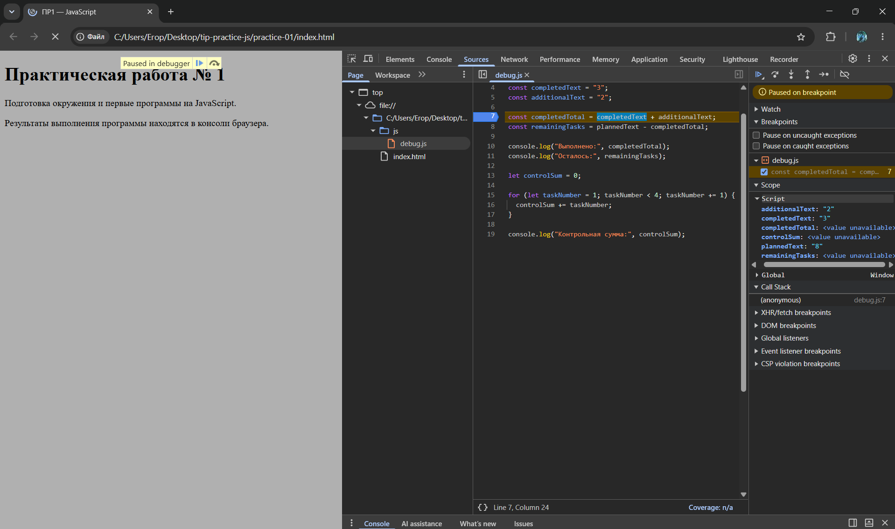

# информация об авторе
ФИО: Чукалов Егор Денисович
Группа ЭФБО-03-25
Вариант 4


# Задание 1
Файл был запущен двумя способами: через встроенный терминал редактора кода и через браузер, оба запуска дали один и тот же результат но отличается только последняя строка вывода: при запуске через Node.js тип document: undefined, при запуске через браузер	тип document: object, результаты двух запусков приложены в папке screenshots


# Задание 2

| Выражение     |  ожидание до запуска | Фактическое значение | Тип результата | объяснение |
|---------- |----------------------|----------------------|-----------|------------|
| "8" + 2   | "82"           | "82"          | string  |Если один операндов имеет тип string то "+" склеивает строки и число 2 тоже приобретает тип string   |
| "8" - 2   | 6           | 6          | number  | "-" не работает со строками, поэтому string приводится к типу number  |
| Number("8") + 2   | 10           | 10           | number |строку перевели в number и сложили с числом 2   |
| "12" > "3"  | false           | false           | boolean  |Строки сравниваются по количеству символов, поэтому получили резьат false   |
| 12 === "12"  |  false         | false          | boolean  |строгое сравнение не приводит типы, отсюда получаем результат false, из-за того, что сравниваем разные типы  |
| Number("")  | 0           | 0            | Number  |пустая строка при приведении к number даёт 0  |
| Number("text")  | NaN            | NaN           | number  |текст нельзя преобразовать в число, отсюда получаем NaN  |
| Boolean("false")   | true           | true           | boolean  | Любая непустая строка даёn true   |
| typeoff null   | "object"          | "object"            |string  | Оператор typeof null возвращает 'object' из-за исторической ошибки JS |
| typeoff NaN  | "number"           | "number"           | string  | NaN является number, отсюда результат "number"  |

# Задание 3
| Вариант | Входные данные | Ожидаемый результат | Фактический результат | Сравнение результатов |
|--------|-----------------|---------------------|------------|---------|
|Вариант 4 | 20, 11| Осталось 9; прогресс 55.0%; статус «В работе». | Всего задач: 20; Выполнено: 11; Осталось: 9; Прогресс: 55.0%; Статус: В работе | Соответствует ожиданиям |
| Нет задач | 0, 0 | Задач пока нет | Задач пока нет | Соответствует ожиданиям |
| Ни одной не выполнено | 5, 0 | Осталось 5; 0.0%; Не начато | Всего задач: 5; Выполнено: 0; Осталось: 5; Прогресс: 0.0%; Статус: Не начато | Соответствует ожиданиям |
| Все выполнено | 5, 5 | Осталось 0; 100.0%; Завершено | Всего задач: 5; Выполнено: 5; Осталось: 0; Прогресс: 100.0%; Статус: Завершено| Соответствует ожиданиям |
| Выполнено больше | 5, 6 | Ошибка | Ошибка: выполнено больше задач, чем существует | Соответствует ожиданиям |
| Отрицательное | -1, 0 | Ошибка | Ошибка: количество задач не может быть отрицательным | Соответствует ожиданиям |
| Дробное | 5, 2.5 | Ошибка | Ошибка: количество задач должно быть целым | Соответствует ожиданиям |
| Строка | "5", 2 | Ошибка | Ошибка: количество задач должно быть числом | Соответствует ожиданиям |
| Верхняя граница | 1001, 0 | Ошибка | Ошибка: общее количество задач не может превышать 1000 | Соответствует ожиданиям |
| NaN | NaN, 0 | Ошибка | Ошибка: недопустимое числовое значение | Соответствует ожиданиям |

Вывод для варианта 4 при запуске через node был предоставлен в таком виде: 
Всего задач: 20;
Выполнено: 11;
Осталось: 9;
Прогресс: 55.0%;
Статус: В работе;

# Задание 4

| Вариант | Входные данные | Ожидаемый результат | Фактический результат | Сравнение результатов |
|---|---|---|---|---|
| Мой вариант 4 | 20, 11, 6 | 2 дня, в последний день 3 задачи | 6, 3; Потребуется дней: 2 | Соовтветствует ожиданиям |
| Вариант 1 | 12, 5, 3 | 3 дня, в последний день 1 задача | 3, 3, 1; Потребуется дней: 3 | Соответствует ожиданиям |
| Вариант 2 | 10, 4, 3 | 2 дня по 3 задачи | 3, 3; Потребуется дней: 2 | Соответствует ожиданиям |
| Вариант 3 | 5, 3, 10 | 1 день, выполнено 2 | 2; Потребуется дней: 1 | Соответствует ожиданиям |
| Вариант 4 | 5, 5, 2 | 0 дней, цикл не идет | Все задачи уже выполнены; Потребуется дней: 0 | Соответствует ожиданиям |
| Вариант 5 | 0, 0, 2 | 0 дней, цикл не идет | 0; Задач пока нет; Потребуется дней: 0 | Соответствует ожиданиям |
| Вариант 6 | 5, 2, 0 | Ошибка | Ошибка: дневная норма должна быть от 1 до 1000 | Соответствует ожиданиям |
| Вариант 7 | 5, 2, 1.5 | Ошибка | Ошибка: дневная норма должна быть целой | Соответствует ожиданиям |
| Вариант 8 | 5, 6, 2 | Ошибка | Ошибка: выполнено больше задач, чем существует | Соответствует ожиданиям |
| Вариант 9 | 5, 2, "2" | Ошибка | Ошибка: дневная норма должна быть числом | Соответствует ожиданиям |
| Вариант 10 | 5, 2, 1001 | Ошибка | Ошибка: дневная норма должна быть от 1 до 1000 | Соответствует ожиданиям |


# Задание 5

Исходный вывод `debug.js`:

```text
Выполнено: 32
Осталось: -24
Контрольная сумма: 6
```

Результат неверный



| Ошибка | Что наблюдалось | Причина | Исправление | Результат после исправления |
|---|---|---|---|---|
| Обработка количества задач | Выполнено: 32, Осталось: -24; в Scope `'completedTotal = "32"` | Операнды — строки, `+` выполняет конкатенацию |`Number()` для исходных строк | `Выполнено: 5`, `Осталось: 3` |
| Граница цикла | Сумма 6; цикл вышел при `taskNumber = 4`, не прибавив его | Условие `<4` исключает 4 | Заменить на `taskNumber <= 4` | Контрольная сумма: 10 |

Корректный вывод:

```text
Выполнено: 5
Осталось: 3
Контрольная сумма: 10
```

# Дополнительное задание А
В задании порядок обработки именно такой потому что:
`typeof()` - проверяет чтобы оба входных значения были строками
`trim()` - убирает пробелы с левой и правой стороны от входных значений, в случае введения пустой строки, она будет отклонена
`Number()` - делает из строки число, которое в последствии проходит проверку по такому же алгоритму как в задании 3


| № | Проверка | Водные данные | Ожидаемый результат | Фактический результат | Итог |
|---|---|---|---|---|---|---|
| 1 | Вариант 4, обычные строки | `"20"`  `"11"` | Осталось: 9, Прогресс: 55.0%, Статус: В работе |
| 2 | Пробелы по краям | `" 20 "`  `"  11"` | Осталось: 9, Прогресс: 55.0%, Статус: В работе |
| 3 | Пустая строка | `""`  `"5"` | Ошибка: пустой ввод | | |
| 4 | Строка из пробелов | `"   "` | `"5"` | Ошибка: пустой ввод  |
| 5 | Нечисловая строка | `"abc"`  `"5"` | Ошибка: введено не число или бесконечное значение  |
| 6 | Дробное число | `"12"`  `"2.5"` | Ошибка: количество задач должно быть целым  |
| 7 | Бесконечность | `"Infinity"`  `"5"` | Ошибка: введено не число или бесконечное значение |
| 8 | Значение null | `null`  `"5"` | Ошибка: входные данные должны быть строками | 
| 9 | Значение undefined | `undefined`  `"5"` | Ошибка: входные данные должны быть строками | 
| 10 | Собственная: частично числовая строка | `"12abc"`  `"5"` | Ошибка: введено не число или бесконечное значение | 
| 11 | Собственная: экспоненциальная запись, верхняя граница | `"1e3"`  `"0"` | Всего задач: 1000, Осталось: 1000, Прогресс: 0.0%, Статус: Не начато | 
| 12 | Собственная: выполнено больше, чем есть | `"5"`  `"6"` | Ошибка: выполнено больше задач, чем существует | 